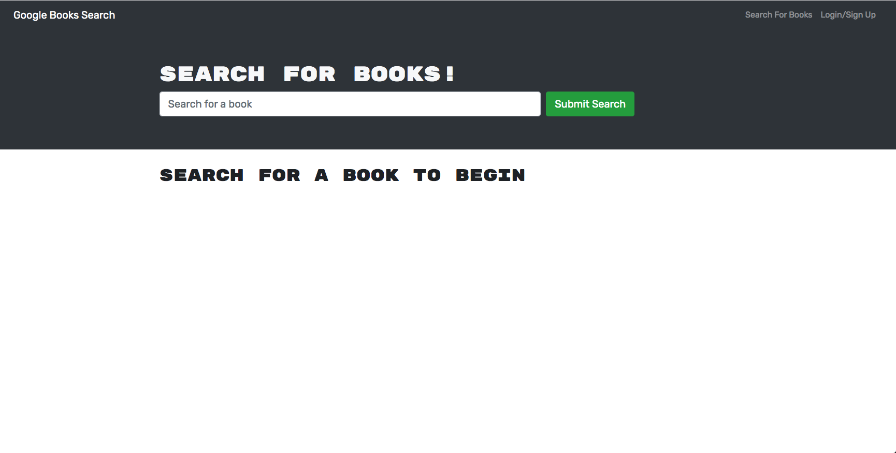
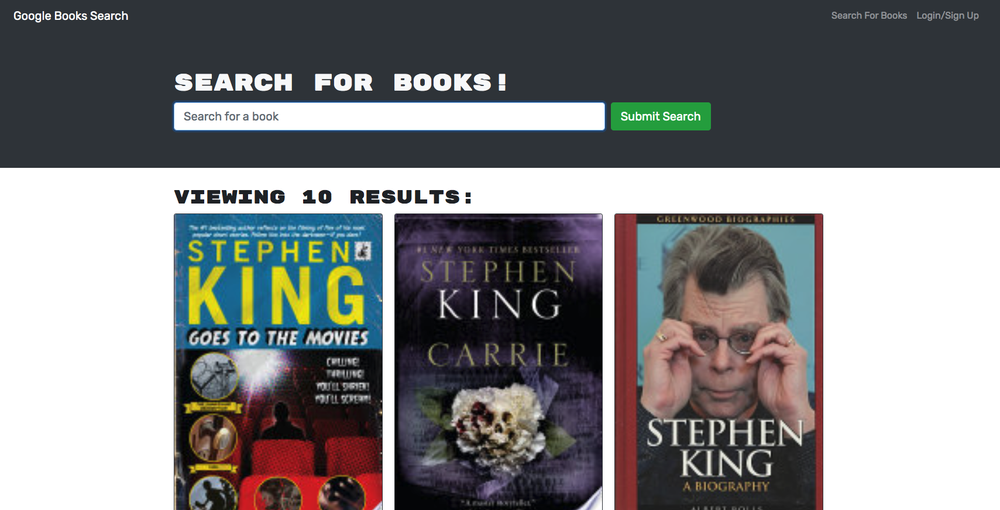

# Book Search Engine

## Description
For this assignment, we were given starter code to finish the Book Search Engine app. This app allows users to search for books and save them. The project uses MongoDB, Node.js/Express.js and API.

## Deployed Link
https://cryptic-refuge-00558.herokuapp.com/

## Screenshot of App

## Questions/Concers
For any questions/concerns, please email me at jerrytrueba10@gmail.com